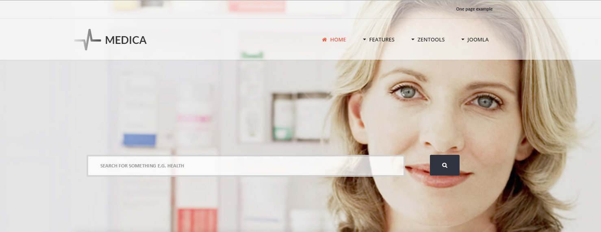
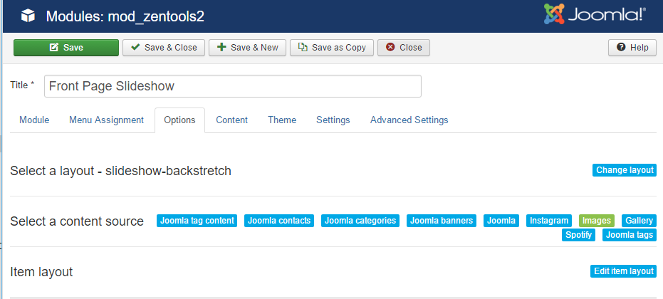
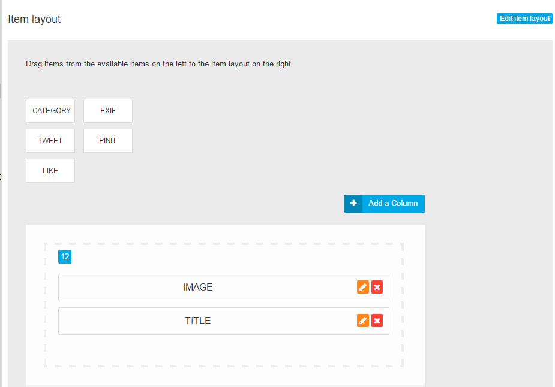
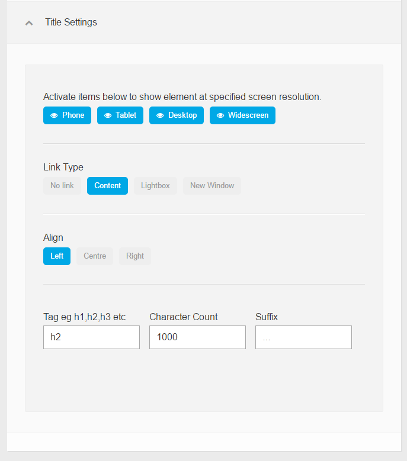
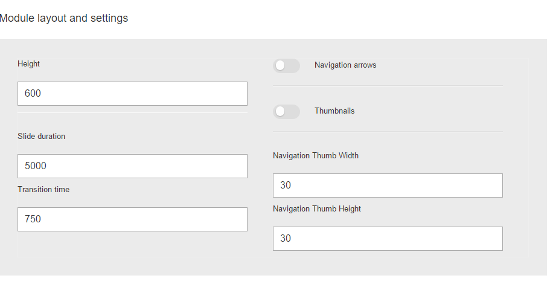
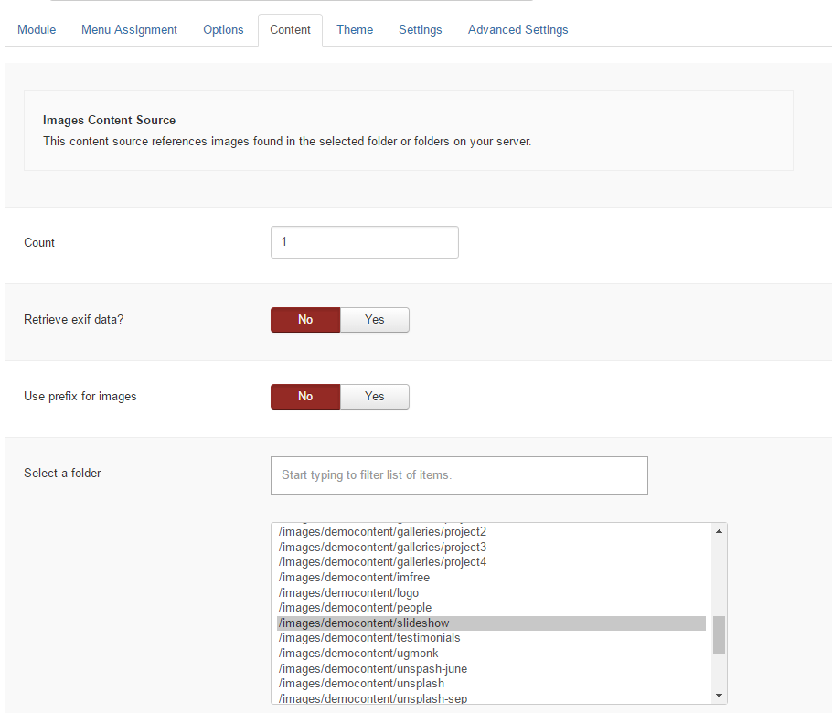

The background image comes from a zentools2 module assigned to the 'banner' position. In the quickstart package the module is titled 'Front Page Slideshow' and has an id of 463.

##Options

The module uses the 'slideshow-backstretch' layout and Joomla articles as a content source.

It uses 2 elements in the layout, image and title.

###Image Settings

###Layout Settings

Under the layout and elements are the general slideshow options. The height is set to 600px.

##Content

In the content tab, the number of items is set to 1 and the folder that contains the image to be used is selected.

