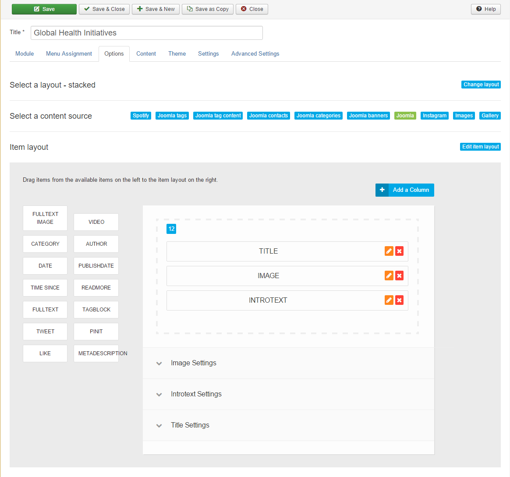
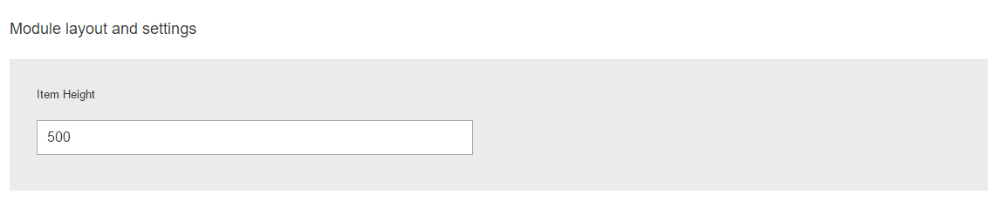
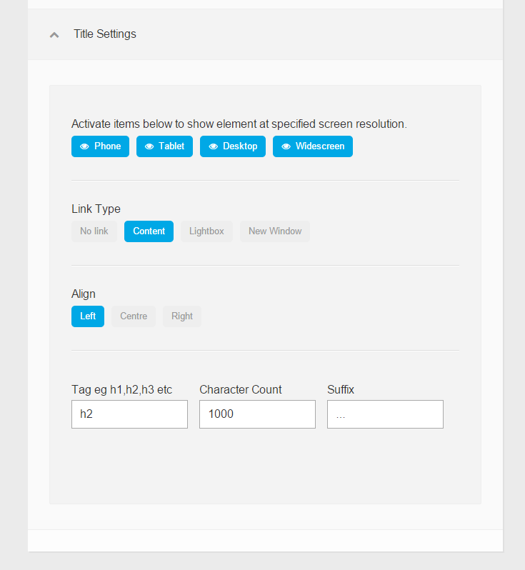
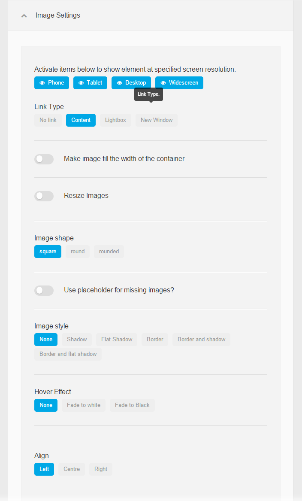
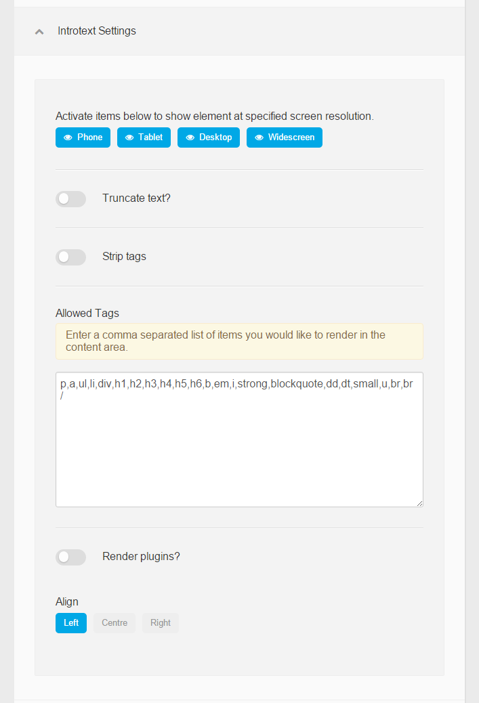
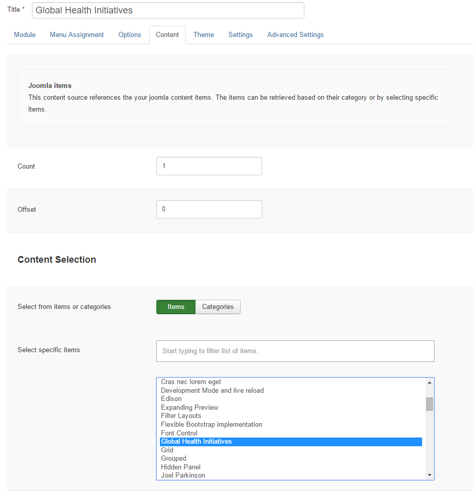
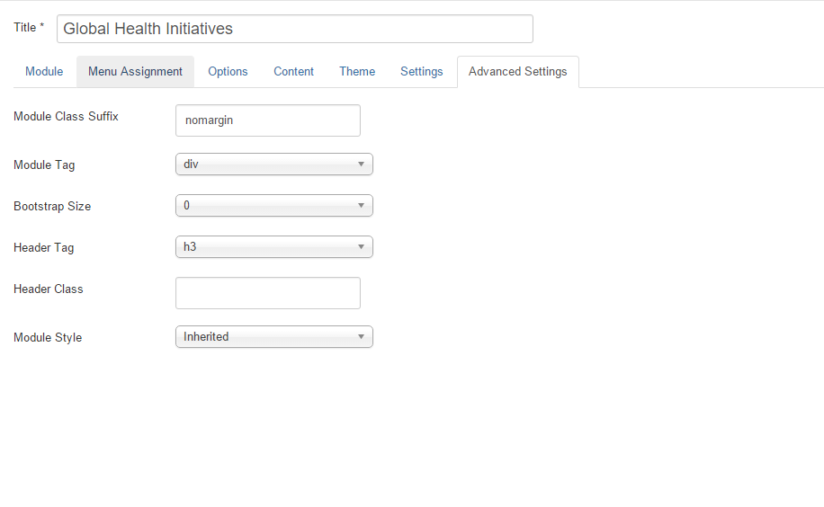

The 'Global Health Initiatives' module is a Zentools2 module assigned to the 'bottom1' position, using the 'stacked' layout and Joomla as a content source. In the quickstart package, the module is titled 'Global Health Initiatives' and has an id of 464.

In the template settings, in the theme tab > row styles, the bottom row style is set to 'fullwidth' so that the module shows at 100% of the browser window.

##Overview

###Elements

The module uses 3 elements, title, image and introtext.

###Module Layout

Under the element selection and options are the module layout settings, where the height of the module is set to 500px.

 

###Title Settings

###Image Settings

###Introtext Settings

##Content

In the quickstart package, the content is set to list items (rather than categories) and the 'Global Health Initiatives' article is selected. The count (number of articles) is set to 1.
The link type is set to 'Item Link'.

##Advanced

In the advanced tab, there is a module class suffix of ' nomargin' (There is a space before the n).

