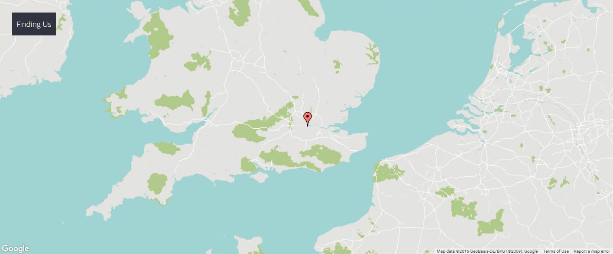
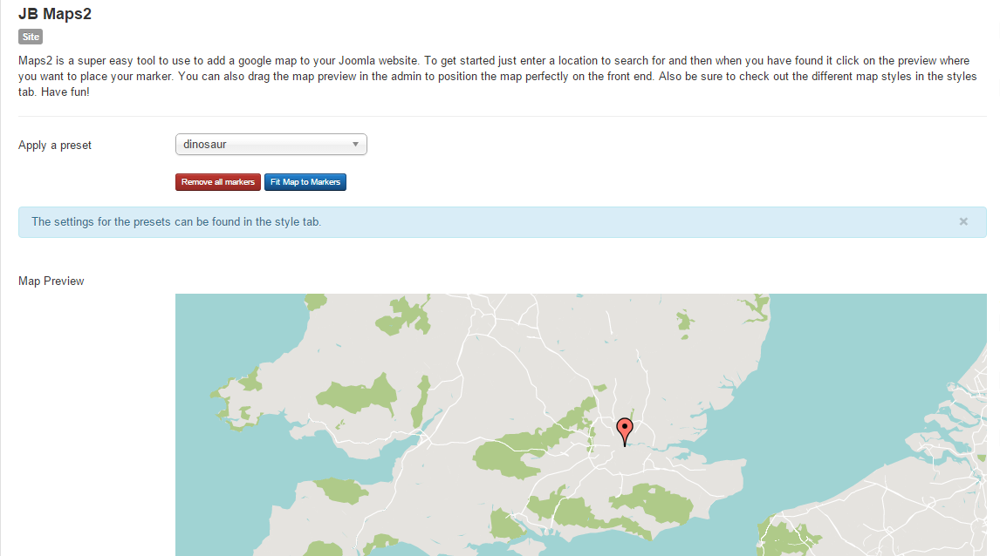
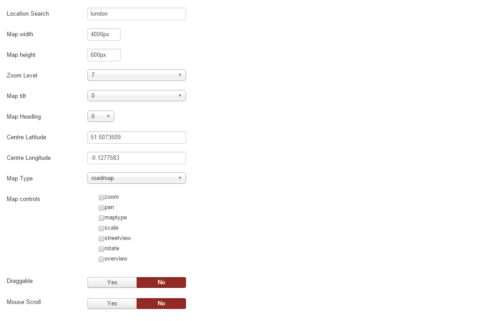
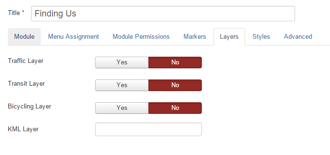
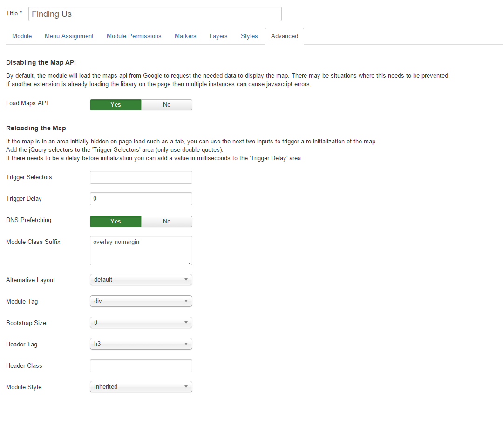

The 'Finding Us' module is a JB Maps 2 module assigned to the 'bottom1' position. In the quickstart package it is titled 'Finding Us' and has a module id of 484.

In the template settings, in the theme tab > row styles, the bottom row style is set to 'fullwidth' so that the module shows at 100% of the browser window.

##Main Settings Tab

###Preset

The demo site uses the preset 'dinosaur'. The preset controls the colour of the map and the type of elements that will be displayed.

The marker is added by clicking on the map where the marker should be placed.

###Main Settings

The main display settings for the module are as follows.

##Layers Tab

All layers are turned off.

##Advanced Tab

In the advanced tab, all options are set to the default other than the module class suffix of ' overlay nomargin'. (with a space before overlay). The overlay class shows the module title over the top of the map in the left corner, the nomargin class removes the margins of the module output.

##Further Reading

You can find the full documentation for the JB Maps 2 module here: [JB Maps2 Documentation](http://docs.joomlabamboo.com/joomla-extensions/jb-maps2-documentation "Maps2 Documentation")
