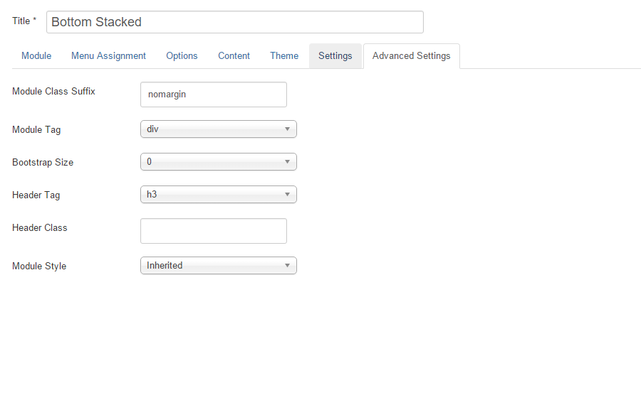

The quote module is a zentools2 module. In the quickstart package it is titled 'Bottom Stacked', id 465 and is assigned to the 'bottom1' position.

It used the 'stacked' layout and 'gallery' as a content source.

##Overview

###Elements

The module uses 3 elements, image, title and introtext.

####Image settings

####Title Settings

####Introtext Settings

##Content

The module is set to show one item.

After dragging an image into the gallery area, expand the item by clicking on the green icon and fill in the intortext area.

You can find more information about how to use the gallery content source here: [zentools2 curated gallery instructions](http://zentools2.joomlabamboo.com/content-sources/curated-gallery)

##Advanced

In the advanced tab, the module has a class suffix of ' nomargin' (with a space at the start).

