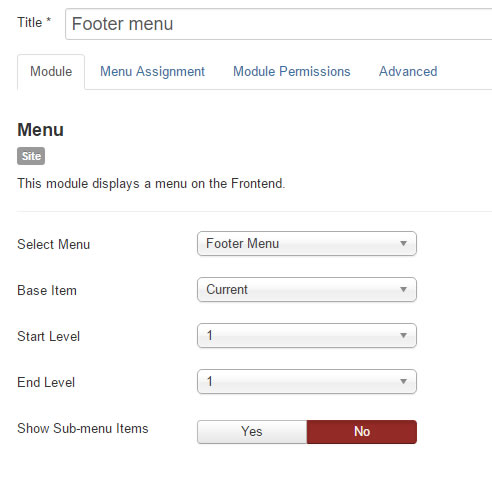
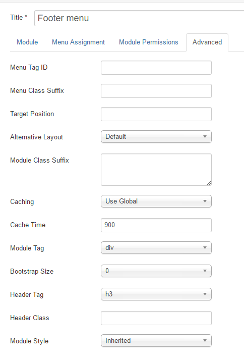

The bottom area of the page is comprised of a menu module and a custom html module.

##Menu Module

In the quickstart package, the menu module is titled 'Footer menu' (id 119) and it is assigned to the 'footer' position. The general settings are as follows.

###Advanced Tab

All settings in the advanced tab are default with no class suffixes.

##Custom HTML Module

The logo and copyright text come from a Custom HTML module, also assigned to the 'footer' position (Ordering modules is done through the module manager screen by dragging the module up and down after clicking on the ordering column).

The HTML content of the module is as follows (substitute the image path for one of your own images):

    

    
Verse. 2015. All Rights Reserved.  <em>3015 Evergreen Terrace, Humphrey, United States.</em>

All advanced and other options are defaults.

